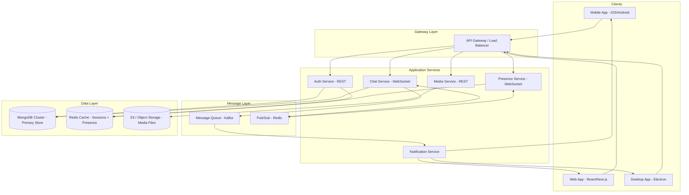
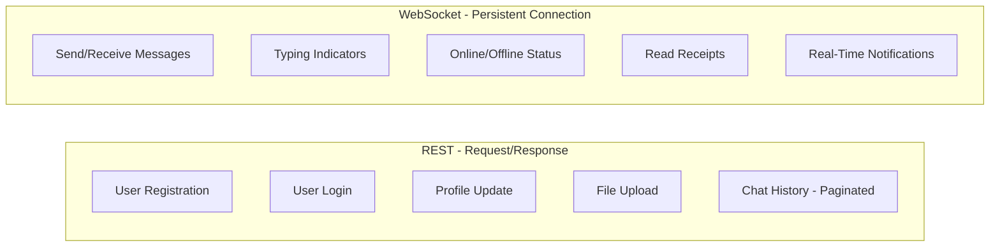
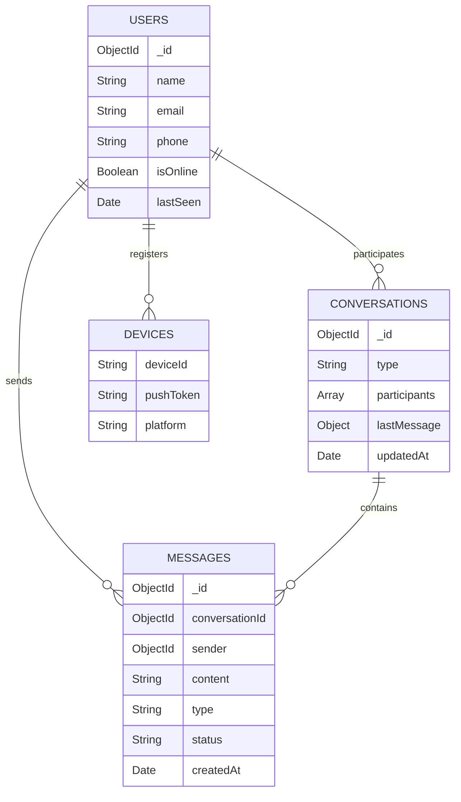
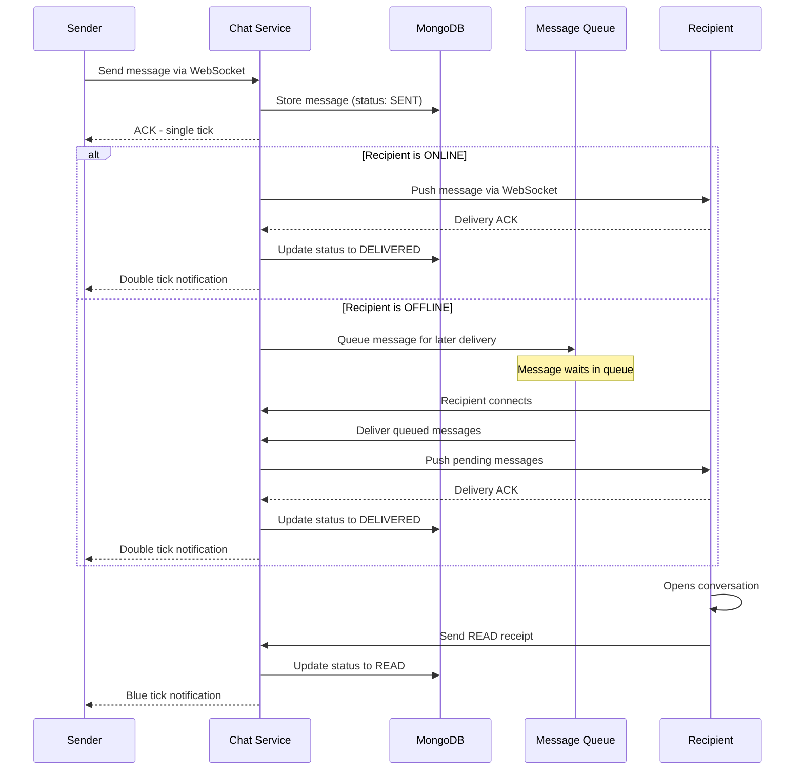
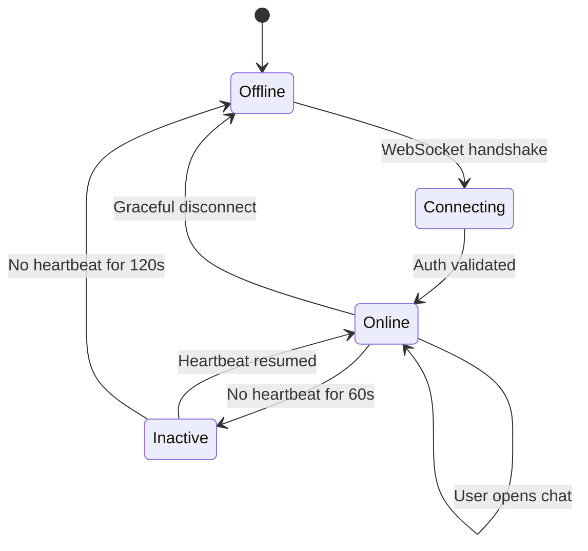
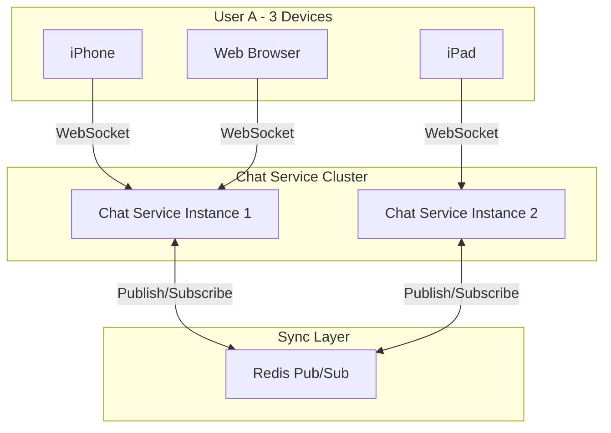
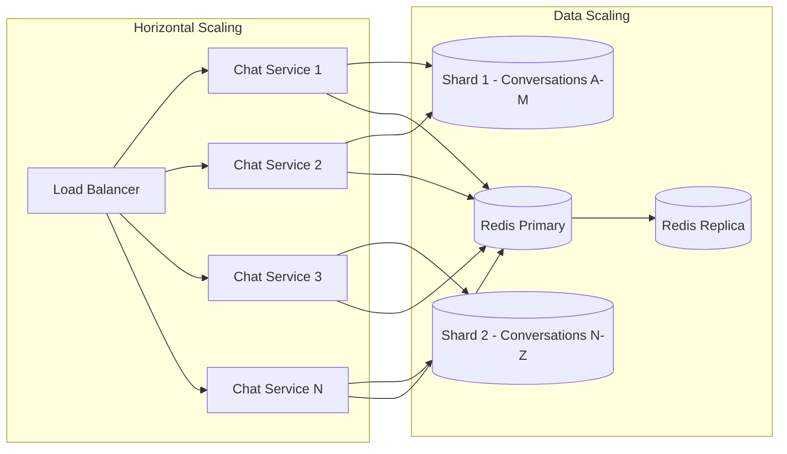

# KalpIntel - Secure Authentication System

A production-grade authentication system built with the MERN stack that implements secure user registration, email verification, JWT-based login, multi-device session management, and password recovery — with a strong emphasis on data integrity under concurrent access.

## Tech Stack

| Layer     | Technology              |
|-----------|-------------------------|
| Frontend  | Next.js (App Router)    |
| Backend   | Node.js, Express.js     |
| Database  | MongoDB (Mongoose ODM)  |
| Auth      | JWT, bcrypt             |
| Email     | Nodemailer (SMTP)       |

## Project Structure

```
KalpIntel/
├── client/                     # Next.js frontend
│   └── src/
│       ├── app/
│       │   ├── register/       # User signup page
│       │   ├── login/          # User login page
│       │   ├── verify-email/   # Email verification handler
│       │   ├── forgot-password/# Password reset request
│       │   ├── reset-password/ # Password reset form
│       │   ├── dashboard/      # Protected user dashboard
│       │   └── devices/        # Active sessions & device management
│       ├── components/
│       │   ├── Button.js       # Reusable button component
│       │   └── FormInput.js    # Reusable form input component
│       └── lib/
│           └── api.js          # Centralized API client
├── server/                     # Express backend
│   └── src/
│       ├── config/
│       │   └── db.js           # MongoDB connection setup
│       ├── controllers/
│       │   ├── authController.js     # Register, login, verify, reset
│       │   └── sessionController.js  # Logout, device list, session revoke
│       ├── middlewares/
│       │   └── auth.js         # JWT verification & session validation
│       ├── models/
│       │   ├── User.js         # User schema with password hashing
│       │   └── Session.js      # Session schema with compound index
│       ├── routes/
│       │   ├── auth.js         # Auth endpoints
│       │   └── session.js      # Session endpoints
│       ├── utils/
│       │   ├── token.js        # Crypto token generator
│       │   └── email.js        # Verification & reset email templates
│       ├── app.js              # Express app configuration
│       └── server.js           # Server entry point
└── .gitignore
```

## Project Setup

### Prerequisites

- Node.js (v18 or above)
- MongoDB (local instance or Atlas cluster)
- Gmail account with App Password for email service

### 1. Clone the Repository

```bash
git clone https://github.com/your-username/KalpIntel.git
cd KalpIntel
```

### 2. Backend Setup

```bash
cd server
npm install
```

Create a `.env` file inside `/server`:

```
PORT=5000
MONGO_URI=mongodb://127.0.0.1:27017/kalpintel-auth
JWT_SECRET=your_strong_random_secret_key
JWT_EXPIRES_IN=7d

EMAIL_HOST=smtp.gmail.com
EMAIL_PORT=587
EMAIL_USER=your_email@gmail.com
EMAIL_PASS=your_gmail_app_password

CLIENT_URL=http://localhost:3000
```

Start the backend:

```bash
npm run dev
```

### 3. Frontend Setup

```bash
cd client
npm install
```

Create a `.env.local` file inside `/client`:

```
NEXT_PUBLIC_API_URL=http://localhost:5000/api
```

Start the frontend:

```bash
npm run dev
```

The application will be available at `http://localhost:3000`.

---

## Authentication Flow

The system implements a complete authentication lifecycle with security at every stage.

### Registration

```
User submits name, email, password
        |
        v
Server validates input (email format, password length, duplicate check)
        |
        v
Password is hashed using bcrypt with 12 salt rounds
        |
        v
User document is created with isVerified = false
        |
        v
A random verification token is generated (crypto.randomBytes)
        |
        v
Verification email is sent with a tokenized link
        |
        v
User must click the link to set isVerified = true
```

- Passwords are never stored in plain text
- Verification tokens expire after 24 hours
- Unverified users cannot log in

### Login

```
User submits email and password
        |
        v
Server finds user by email, compares password hash
        |
        v
Checks isVerified === true (rejects unverified accounts)
        |
        v
Parses User-Agent to extract device, browser, OS info
        |
        v
Creates or updates a Session document (atomic upsert)
        |
        v
Signs a JWT containing userId and jti (unique session identifier)
        |
        v
Returns JWT token to the client
        |
        v
Client stores token and sends it via Authorization header
```

### Protected Routes

Every protected endpoint passes through the `authenticate` middleware:

1. Extracts JWT from `Authorization: Bearer <token>` header (or cookie fallback)
2. Verifies the token signature and expiry
3. Looks up the session in the database using the `jti` claim
4. If the session does not exist (logged out or revoked), the request is rejected
5. Updates `lastActive` timestamp on the session document
6. Attaches `userId`, `jti`, and `sessionId` to the request object

This means that even if a JWT is valid, it is rejected if the session has been revoked from another device.

### Password Reset

```
User requests reset -> server generates a reset token
        |
        v
Token is stored on the user document with a 15-minute expiry
        |
        v
Reset email is sent with a tokenized link
        |
        v
User submits new password with the token
        |
        v
Server validates token (exists + not expired)
        |
        v
Password is updated, token is cleared (single-use enforcement)
        |
        v
ALL active sessions for the user are deleted (Session.deleteMany)
        |
        v
User must log in again on every device with the new password
```

Key security properties:
- Reset tokens expire after 15 minutes
- Tokens are single-use (cleared immediately after use)
- Password reset invalidates all existing sessions across all devices

---

## Session Management Strategy

### Data Model

Each login creates a **Session** document in MongoDB:

```javascript
{
    userId:     ObjectId,     // Reference to the user
    jti:        String,       // Unique identifier embedded in the JWT
    device:     String,       // "Desktop", "Mobile", etc.
    browser:    String,       // "Chrome", "Firefox", etc.
    os:         String,       // "Windows 10", "Linux", etc.
    ip:         String,       // Client IP address
    lastActive: Date,         // Updated on every authenticated request
    createdAt:  Date,         // When the session was created
}
```

### Indexes

```javascript
// Fast lookup for session validation on every request
{ userId: 1 }

// Compound unique index for race condition prevention
{ userId: 1, device: 1, browser: 1, os: 1 } (unique)
```

### Session Operations

| Action                    | What Happens                                                    |
|---------------------------|-----------------------------------------------------------------|
| Login                     | Creates a new session or updates an existing one for the device |
| Authenticated request     | Updates `lastActive` timestamp on the session                   |
| Logout (current device)   | Deletes the session matching the current `jti`                  |
| Logout all devices        | Deletes all sessions for the `userId`                           |
| Revoke specific device    | Deletes the session by its `_id`                                |
| Password reset            | Deletes all sessions for the user                               |

### Device Management UI

The `/devices` page displays all active sessions for the logged-in user:
- Device type, browser, operating system
- IP address
- Last active timestamp
- Current session is tagged and cannot be revoked from the list
- Any other session can be individually revoked with one click

---

## Handling Race Conditions

### The Problem

A user logs in from two different devices at the exact same time. Both login requests hit the database simultaneously. Without proper handling, this can result in:
- Duplicate session documents for the same device fingerprint
- Inconsistent session state
- Data integrity violations

### The Solution: Three-Layer Defense

#### Layer 1: Compound Unique Index (Database-Level Guarantee)

```javascript
sessionSchema.index(
    { userId: 1, device: 1, browser: 1, os: 1 },
    { unique: true }
);
```

MongoDB enforces this constraint at the storage engine level. It is physically impossible for two documents with the same combination of `userId + device + browser + os` to exist in the collection. This is the ultimate safety net — regardless of application-level logic, the database itself prevents duplicates.

#### Layer 2: Atomic Upsert (Single-Operation Read-Write)

```javascript
await Session.findOneAndUpdate(
    { userId, device, browser, os },       // find criteria
    { $set: { jti, ip, lastActive } },     // atomic update
    { upsert: true, new: true }            // create if not found
);
```

`findOneAndUpdate` is a single atomic operation in MongoDB. It acquires a write lock on the document, performs the find and update in one step, and releases the lock. There is no gap between "check if exists" and "insert" — the two operations are indivisible. This eliminates the classic TOCTOU (time-of-check-to-time-of-use) race condition.

#### Layer 3: Duplicate Key Error Recovery (Edge Case Handling)

In the rare scenario where two upserts for the same device fingerprint execute at the exact same microsecond and both attempt to insert (because neither found an existing document), MongoDB will allow one and reject the other with error code `11000` (duplicate key violation).

The application catches this and retries as a plain update:

```javascript
try {
    await Session.findOneAndUpdate(
        { userId, device, browser, os },
        { $set: { jti, ip, lastActive } },
        { upsert: true, new: true }
    );
} catch (dupErr) {
    if (dupErr.code === 11000) {
        await Session.findOneAndUpdate(
            { userId, device, browser, os },
            { $set: { jti, ip, lastActive } },
            { new: true }
        );
    } else {
        throw dupErr;
    }
}
```

### Race Condition Scenarios

**Scenario 1: Same user, same device, simultaneous logins**

Both requests identify the same device fingerprint. The atomic upsert means one request creates the session and the other updates it. If both try to create simultaneously, the unique index blocks the duplicate and the retry logic handles it. Result: exactly one session document exists.

**Scenario 2: Same user, different devices, simultaneous logins**

Each request has a different device fingerprint, so they target different documents. No conflict occurs. Each device gets its own session. Result: one session per device, no interference.

**Scenario 3: One request succeeds, network drops the other**

The successful request creates/updates the session normally. The failed request never reaches the database, so no cleanup is needed. The client can simply retry login.

### Why Not Transactions?

MongoDB transactions add overhead and are designed for multi-document operations. Our race condition involves a single document per device fingerprint. `findOneAndUpdate` with `upsert: true` combined with a unique index provides the same atomicity guarantee with better performance and simpler code. Transactions would be overkill here.

---

---

# **Architecture Question: Real-Time Chat System (WhatsApp-like)**

> **Note:** This section is design-only. No implementation is required.

---

## **1. High-Level System Architecture**

The system is decomposed into independent, loosely coupled services. Each service owns a single responsibility and communicates with others through well-defined interfaces.



### **Service Responsibilities**

| Service | Protocol | Responsibility |
|---------|----------|----------------|
| **Auth Service** | REST | User registration, login, JWT token management, profile CRUD |
| **Chat Service** | WebSocket | Real-time message routing, conversation management, message persistence |
| **Presence Service** | WebSocket | Online/offline tracking, last seen, typing indicators |
| **Media Service** | REST | File upload/download, image compression, thumbnail generation |
| **Notification Service** | Push | FCM/APNs push notifications for offline users |

### **Why Microservices?**

- **Independent scaling** - Chat Service handles 100x more traffic than Auth Service; they scale independently
- **Fault isolation** - If Media Service crashes, chat continues uninterrupted
- **Technology flexibility** - Chat Service can be written in Go for performance while Auth stays in Node.js
- **Team autonomy** - Different teams can own and deploy services independently

---

## **2. Communication Method: REST vs WebSockets**

The system uses a **hybrid approach** — REST for stateless operations and WebSockets for real-time bidirectional communication.



### **Decision Matrix**

| Factor | REST | WebSocket | Choice For Chat |
|--------|------|-----------|-----------------|
| Latency | Higher (new connection per request) | Very low (persistent connection) | **WebSocket** |
| Server push | Not possible (client must poll) | Native support | **WebSocket** |
| Connection overhead | New TCP handshake per request | Single handshake, persistent | **WebSocket** |
| Scalability | Stateless, easy horizontal scaling | Stateful, needs sticky sessions | REST for stateless ops |
| Caching | HTTP caching built-in | Not cacheable | REST for static data |
| Binary data | Multipart upload | Frame-based | REST for file uploads |

### **WebSocket Connection Lifecycle**

1. Client authenticates via REST and receives a JWT
2. Client opens WebSocket connection with the JWT in the handshake header
3. Server validates the JWT and associates the socket with the user
4. Bidirectional communication begins (messages, typing, presence)
5. Heartbeat pings every 30 seconds to keep the connection alive
6. On disconnect, the server updates presence and queues undelivered messages

---

## **3. Database Schema Design**

### **Users Collection**

Stores user identity, authentication credentials, and device registration tokens.

```javascript
{
    _id:            ObjectId,
    name:           String,
    email:          String,           // unique, indexed
    phone:          String,           // unique, indexed
    password:       String,           // bcrypt hash
    avatar:         String,           // URL to profile image
    about:          String,           // Status/bio text
    lastSeen:       Date,
    isOnline:       Boolean,
    devices: [{
        deviceId:   String,           // Unique device identifier
        pushToken:  String,           // FCM/APNs token
        platform:   String,           // "ios", "android", "web"
        lastActive: Date
    }],
    settings: {
        readReceipts:   Boolean,      // Show read receipts to others
        lastSeenVisible: Boolean,     // Show last seen to others
        profilePhotoVisibility: String // "everyone", "contacts", "nobody"
    },
    createdAt:      Date,
    updatedAt:      Date
}
```

**Indexes:** `{ email: 1 }` unique, `{ phone: 1 }` unique

---

### **Conversations Collection**

Represents a chat thread between two or more users. Stores metadata and the last message for quick listing.

```javascript
{
    _id:            ObjectId,
    type:           String,           // "private" or "group"
    participants:   [ObjectId],       // Array of user IDs, indexed
    groupMeta: {
        name:       String,           // Group name
        avatar:     String,           // Group image URL
        admin:      [ObjectId],       // Admin user IDs
        description: String
    },
    lastMessage: {
        content:    String,           // Preview text
        sender:     ObjectId,
        type:       String,           // "text", "image", etc.
        timestamp:  Date
    },
    pinnedBy:       [ObjectId],       // Users who pinned this chat
    mutedBy: [{
        userId:     ObjectId,
        until:      Date              // Mute expiration
    }],
    createdAt:      Date,
    updatedAt:      Date
}
```

**Indexes:** `{ participants: 1 }`, `{ updatedAt: -1 }` for sorted chat list

---

### **Messages Collection**

Core message storage. Designed for high write throughput and efficient pagination.

```javascript
{
    _id:            ObjectId,
    conversationId: ObjectId,         // Reference to conversation
    sender:         ObjectId,         // Reference to user
    content:        String,           // Text content or caption
    type:           String,           // "text", "image", "video", "audio", "document", "location"
    media: {
        url:        String,           // S3/CDN URL
        thumbnail:  String,           // Compressed preview URL
        mimeType:   String,
        size:       Number            // Bytes
    },
    status:         String,           // "sent", "delivered", "read"
    deliveredTo: [{
        userId:     ObjectId,
        timestamp:  Date
    }],
    readBy: [{
        userId:     ObjectId,
        timestamp:  Date
    }],
    replyTo:        ObjectId,         // Parent message ID for threads
    forwarded:      Boolean,
    deleted:        Boolean,          // Soft delete (shows "message deleted")
    editedAt:       Date,             // If message was edited
    createdAt:      Date
}
```

**Indexes:**
- `{ conversationId: 1, createdAt: -1 }` - paginated message history
- `{ sender: 1, createdAt: -1 }` - user's sent messages
- `{ conversationId: 1, status: 1 }` - unread count queries

### **Schema Relationship Diagram**



---

## **4. Message Delivery Flow (Sent, Delivered, Read)**

The message lifecycle follows a three-stage acknowledgment pattern, similar to WhatsApp's tick system.



### **Status Transitions**

| Status | Visual | Trigger | What Happens |
|--------|--------|---------|--------------|
| **SENT** | Single tick | Server stores the message | Message is persisted in DB, sender gets confirmation |
| **DELIVERED** | Double tick | Recipient's device receives the message | Delivery ACK sent back, status updated atomically |
| **READ** | Blue tick | Recipient opens the conversation | Read receipt sent via WebSocket, sender notified |

### **Failure Handling in Delivery**

- If the server crashes after storing but before pushing: the message is in DB with status SENT, recipient pulls it on next sync
- If the recipient's ACK is lost: the server retries delivery on next heartbeat; duplicate delivery is handled by idempotent message IDs
- If the sender disconnects before receiving the ACK: on reconnect, the client queries message status and updates the UI

---

## **5. Online/Offline Presence Handling**

Presence is one of the most challenging features at scale because every status change must be broadcast to potentially hundreds of contacts.



### **Presence Architecture**

| Component | Role |
|-----------|------|
| **WebSocket Connection** | Primary presence signal; connected = online |
| **Heartbeat (30s interval)** | Confirms liveness; detects zombie connections |
| **Redis Cache** | Stores current presence state; sub-millisecond lookups |
| **Redis Pub/Sub** | Broadcasts presence changes across Chat Service instances |
| **MongoDB** | Persists `lastSeen` timestamp; source of truth for offline users |

### **How It Works**

1. **User connects:** WebSocket handshake succeeds, Redis sets `user:{id}:online = true`, broadcasts to contacts via Pub/Sub
2. **Heartbeat:** Client sends ping every 30 seconds. Server refreshes the TTL on the Redis key. If no ping for 60 seconds, the key expires automatically
3. **Graceful disconnect:** Client sends a disconnect event. Server immediately sets `lastSeen = now()` in MongoDB and removes the Redis key
4. **Crash/network loss:** No disconnect event is sent. The Redis key expires after 60 seconds (TTL). The Presence Service detects expiration and updates `lastSeen`
5. **Privacy controls:** If a user has disabled "last seen" visibility, the server returns `null` instead of the actual timestamp to non-contacts

---

## **6. Multi-Device Synchronization Strategy**

A user logged into WhatsApp Web, iPhone, and iPad should see the same messages, read status, and presence across all devices.



### **Synchronization Rules**

| Event | What Happens Across Devices |
|-------|----------------------------|
| **Message sent** from Device 1 | Message appears on Device 2 and Device 3 immediately via Pub/Sub |
| **Message received** | Delivered to all connected devices simultaneously |
| **Read receipt** on Device 2 | Message marked as read on Device 1 and Device 3 |
| **Typing indicator** from Device 1 | Shown to recipient, NOT shown on Device 2 or Device 3 |
| **Delete message** on Device 1 | Deleted across all devices |
| **Device goes offline** | Messages queued and delivered when it reconnects |

### **Conflict Resolution**

When two devices perform conflicting actions simultaneously (e.g., delete a message on one device while replying on another):

- **Last-write-wins** using server timestamps — the action with the later timestamp takes precedence
- **Message ordering** is guaranteed by monotonically increasing server-side sequence numbers per conversation
- **Offline devices** sync by requesting all events since their last known sequence number

---

## **7. Scalability and Failure Handling**

### **Scaling Strategy**



### **Scaling Techniques**

| Challenge | Solution |
|-----------|----------|
| Millions of concurrent WebSocket connections | Horizontal scaling of Chat Service behind a load balancer with sticky sessions |
| Cross-instance message routing | Redis Pub/Sub ensures messages reach the correct server instance |
| Database write throughput | MongoDB sharding by `conversationId` distributes writes across nodes |
| Read-heavy presence queries | Redis caching with TTL-based expiration; MongoDB reads only for cold data |
| Traffic spikes | Kafka message queue absorbs bursts; consumers process at their own pace |
| Media storage | S3-compatible object storage with CDN for global low-latency access |
| Global availability | Multi-region MongoDB replica sets with read preference set to nearest |

### **Failure Scenarios and Recovery**

| Failure | Impact | Recovery Strategy |
|---------|--------|-------------------|
| **Chat Service instance crashes** | Users on that instance disconnect | Clients auto-reconnect to another instance via load balancer. Missed messages are fetched from DB using last known sequence number |
| **MongoDB primary goes down** | Writes temporarily fail | Replica set automatically elects a new primary (typically under 10 seconds). Write concern `majority` ensures no committed data is lost |
| **Redis crashes** | Presence data lost temporarily | Presence rebuilds from active WebSocket connections. Sessions fall back to MongoDB |
| **Kafka broker failure** | Message queue temporarily unavailable | Kafka replication factor of 3 ensures other brokers take over. Producers retry with exponential backoff |
| **Network partition** between services | Some messages delayed | Messages are buffered locally and flushed when connectivity restores. Idempotent message IDs prevent duplicates |
| **Client app crashes** | User appears online briefly | Heartbeat timeout (60s) detects the disconnect. On restart, client syncs from last known message ID |
| **Full datacenter outage** | Entire region goes down | DNS failover routes traffic to standby region. MongoDB cross-region replica set promotes a secondary in the surviving region |

### **Capacity Estimates (for 10 million active users)**

| Metric | Estimate |
|--------|----------|
| Concurrent WebSocket connections | ~2 million (20% online at any time) |
| Messages per second | ~50,000 |
| Chat Service instances needed | ~40 (50K connections per instance) |
| MongoDB storage growth | ~5 TB/year (text messages + metadata) |
| Media storage growth | ~50 TB/year (photos, videos, documents) |
| Redis memory for presence | ~2 GB (20 bytes per online user) |

---

## API Endpoints

### Authentication

| Method | Endpoint                        | Description                    | Auth Required |
|--------|---------------------------------|--------------------------------|---------------|
| POST   | `/api/auth/register`            | Create a new account           | No            |
| GET    | `/api/auth/verify-email/:token` | Verify email address           | No            |
| POST   | `/api/auth/login`               | Log in and receive JWT         | No            |
| GET    | `/api/auth/me`                  | Get current user profile       | Yes           |
| POST   | `/api/auth/forgot-password`     | Request password reset email   | No            |
| POST   | `/api/auth/reset-password/:token` | Reset password with token    | No            |

### Session Management

| Method | Endpoint                        | Description                    | Auth Required |
|--------|---------------------------------|--------------------------------|---------------|
| POST   | `/api/session/logout`           | Logout current device          | Yes           |
| POST   | `/api/session/logout-all`       | Logout all devices             | Yes           |
| GET    | `/api/session/devices`          | List all active sessions       | Yes           |
| DELETE | `/api/session/:sessionId`       | Revoke a specific session      | Yes           |

---

## Security Practices

- Passwords hashed with bcrypt (12 salt rounds)
- JWT tokens with unique `jti` claim for session binding
- HTTP-only cookies with `Secure` and `SameSite` flags in production
- Authorization header support for cross-domain deployments
- Email verification required before login
- Reset tokens are single-use and time-limited (15 minutes)
- Password reset invalidates all active sessions
- Session validation on every authenticated request (not just JWT verification)
- CORS restricted to allowed origins only
- Input validation on all endpoints (email format, password length, ObjectId format)
